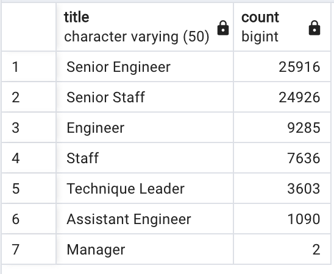
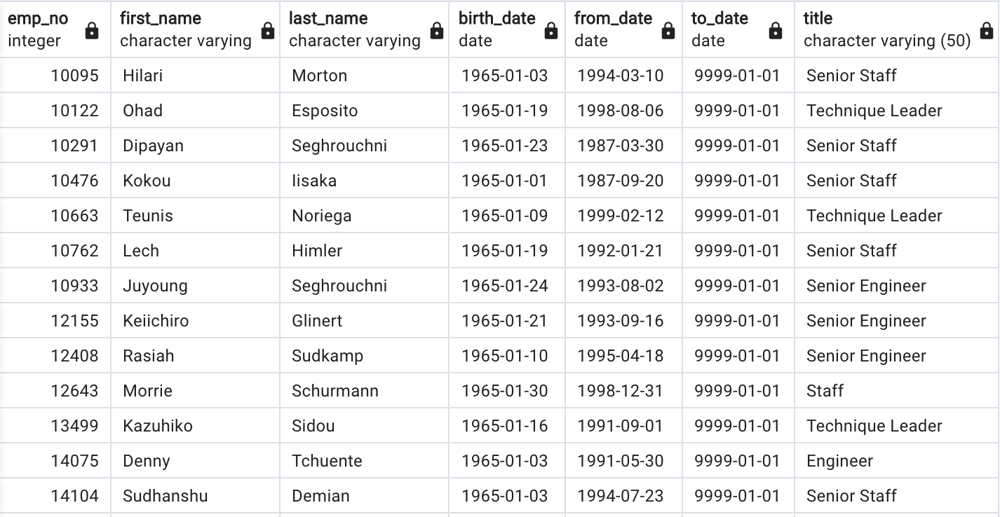

# Silver Tsunami Analysis

## Overview of Silver Tsunami Analysis
Snapshot of employees reaching retirement age and mentorship eligibilty per employee.

### Purpose
The purpose of this analysis is to provide analysis of the number of retiring employees per title, and identify employees who are eligible to participate in a mentorship program. 

## Analysis Results
### Number of Retiring Employees Per Title
 

As per the analysis:
- There 7 titiles where employees are retiring. 
- 72,458 employees are retiring.
- About 25,000 Senior Engineers and Senior Staffs would be retiring.

### Mentorship Eligibility Per Employee
 

As per the analysis:
- There are 1,549 employees eligible for mentorship. 

## Silver Tsunami Summary
The company would have to fill 72458 open positions once employees starts retiring. 
- SQL to find roles will need to be filled as the "silver tsunami" begins to make an impact:

    select count(*) 
    from unique_titles
    order by count(*) DESC
    ;

    Answer: 72458

The company has 1,549 employees to mentor the next generation of employees.

- SQL to find Are there enough qualified, retirement-ready employees in the departments to mentor the next generation of Pewlett Hackard employees?

    select count(*) 
    from mentorship_eligibilty
    ;

    Answer: 1549
